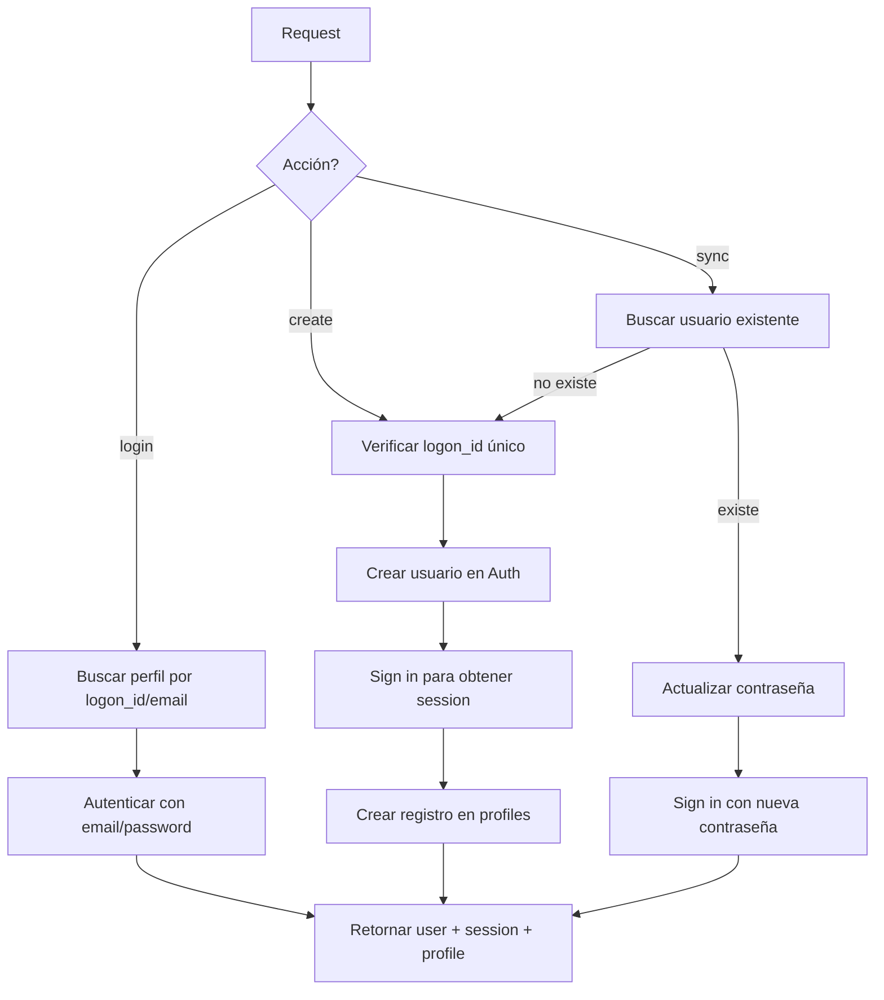
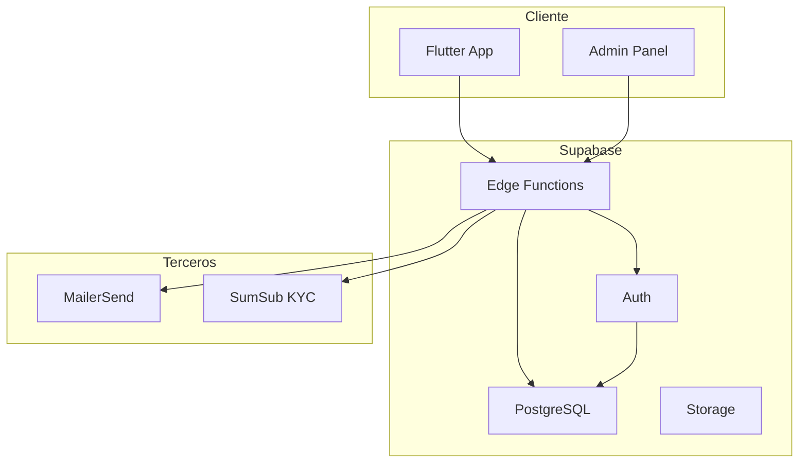

<div align="center">

# 🏦 BlueBank International

### Backend de Servicios Financieros

---


<br><br>


<br><br>

---

**Backend completo para la plataforma bancaria BlueBank**  
Construido sobre Supabase con Edge Functions en TypeScript/Deno,  
migraciones PostgreSQL, y scripts de automatización.

---

| Información                 | Detalle                   |
| :-------------------------- | :------------------------ |
| 📅 **Última Actualización** | Enero 2026                |
| 👥 **Equipo**               | BlueBank Development Team |
| 🌐 **Ambiente**             | Producción / Desarrollo   |
| 📧 **Contacto**             | dev@bluebank.com          |

---

</div>

<br>

## 📑 Tabla de Contenidos

1. [📁 Estructura del Proyecto](#-estructura-del-proyecto)
2. [📂 Detalle de Carpetas y Archivos](#-detalle-de-carpetas-y-archivos)
   - [🗄️ /db - Respaldos de Base de Datos](#️-db---respaldos-de-base-de-datos)
   - [📖 /doc - Documentación Técnica](#-doc---documentación-técnica)
   - [🔧 /scripts - Scripts de Automatización](#-scripts---scripts-de-automatización)
3. [⚡ Edge Functions](#-supabasefunctions---edge-functions)
   - [📁 \_shared/ - Código Compartido](#-_shared---código-compartido)
   - [🔐 auth_manager/ - Gestión de Autenticación](#-auth_manager---gestión-de-autenticación)
   - [👥 beneficiaries/ - Gestión de Beneficiarios](#-beneficiaries---gestión-de-beneficiarios)
   - [🌍 get-countries/ - Catálogo de Países](#-get-countries---catálogo-de-países)
   - [📝 log-event/ - Registro de Auditoría](#-log-event---registro-de-auditoría)
   - [💳 request-recharge/ - Recargas de Tarjetas Prepago](#-request-recharge---recargas-de-tarjetas-prepago)
   - [📧 send-otp/ - Envío de Códigos OTP](#-send-otp---envío-de-códigos-otp)
   - [🛡️ sumsub-proxy/ - Proxy para Verificación KYC](#️-sumsub-proxy---proxy-para-verificación-kyc)
4. [🗃️ Migraciones de Base de Datos](#️-supabasemigrations---migraciones-de-base-de-datos)
   - [Historial de Migraciones](#historial-de-migraciones)
   - [📊 Esquema de Base de Datos](#-esquema-de-base-de-datos)
5. [🔒 Row Level Security (RLS)](#-row-level-security-rls)
6. [⚙️ Configuración](#️-configuración)
7. [🚀 Comandos de Desarrollo](#-comandos-de-desarrollo)
8. [📦 Dependencias](#-dependencias)
9. [🏗️ Arquitectura](#️-arquitectura)
10. [📄 Licencia](#-licencia)

---

## 📁 Estructura del Proyecto

```
SUPABASE_BLUEBANK/
├── 📂 db/                          # Respaldos de base de datos
├── 📂 doc/                         # Documentación técnica
├── 📂 scripts/                     # Scripts de automatización y despliegue
├── 📂 supabase/                    # Núcleo de Supabase
│   ├── 📂 functions/               # Edge Functions (API serverless)
│   └── 📂 migrations/              # Migraciones de base de datos
├── 📄 .env.local                   # Variables de entorno (desarrollo)
├── 📄 .env.production              # Variables de entorno (producción)
├── 📄 package.json                 # Dependencias del proyecto
└── 📄 README.md                    # Este archivo
```

---

## 📂 Detalle de Carpetas y Archivos

### 🗄️ `/db` - Respaldos de Base de Datos

| Archivo          | Descripción                                                   |
| ---------------- | ------------------------------------------------------------- |
| `current_db.sql` | Esquema SQL actual de la base de datos para referencia rápida |

### 📖 `/doc` - Documentación Técnica

| Archivo                    | Descripción                                                 |
| -------------------------- | ----------------------------------------------------------- |
| `auth-manager-function.md` | Documentación detallada de la función de autenticación      |
| `flutter-integration.md`   | Guía de integración con la aplicación Flutter               |
| `profile-creation-fix.md`  | Documentación sobre correcciones en la creación de perfiles |

### 🔧 `/scripts` - Scripts de Automatización

| Script                    | Descripción                                   | Uso                                     |
| ------------------------- | --------------------------------------------- | --------------------------------------- |
| `auth.sh`                 | Autenticación con Supabase CLI                | `./scripts/auth.sh`                     |
| `deploy_all_functions.sh` | Despliegue masivo de todas las Edge Functions | `./scripts/deploy_all_functions.sh`     |
| `deploy_function.sh`      | Despliegue de una función específica          | `./scripts/deploy_function.sh <nombre>` |
| `init_environment.sh`     | Inicialización del entorno de desarrollo      | `./scripts/init_environment.sh`         |
| `migration_repair.sh`     | Reparación de migraciones fallidas            | `./scripts/migration_repair.sh`         |
| `push_db.sh`              | Push de cambios a la base de datos remota     | `./scripts/push_db.sh`                  |
| `unban_ips.sh`            | Desbloqueo de IPs baneadas por rate limiting  | `./scripts/unban_ips.sh`                |

---

## ⚡ `/supabase/functions` - Edge Functions

Las Edge Functions son funciones serverless ejecutadas en el edge (Deno runtime). Procesan solicitudes HTTP y se comunican con la base de datos Supabase.

### 📁 `_shared/` - Código Compartido

| Archivo   | Descripción                                         |
| --------- | --------------------------------------------------- |
| `cors.ts` | Headers CORS reutilizables para todas las funciones |

```typescript
// Configuración CORS exportada
export const corsHeaders = {
  "Access-Control-Allow-Origin": "*",
  "Access-Control-Allow-Headers":
    "authorization, x-client-info, apikey, content-type",
};
```

---

### 🔐 `auth_manager/` - Gestión de Autenticación

**Archivo principal:** `index.ts` (426 líneas)

Función central de autenticación que maneja login, creación de usuarios y sincronización.

#### Acciones Disponibles

| Acción   | Descripción                                         | Campos Requeridos                    |
| -------- | --------------------------------------------------- | ------------------------------------ |
| `login`  | Autenticar usuario existente                        | `identifier`, `password`             |
| `create` | Crear nuevo usuario                                 | `identifier`, `logon_id`, `password` |
| `sync`   | Sincronizar usuario (crear o actualizar contraseña) | `identifier`, `logon_id`, `password` |

#### Interfaces TypeScript

```typescript
interface AuthRequest {
  action: AuthAction; // "login" | "create" | "sync"
  identifier: string; // Email del usuario
  logon_id?: string; // ID de inicio de sesión único
  password: string; // Contraseña
  name?: string; // Nombre (opcional)
  phone_number?: string; // Teléfono (opcional)
}

interface AuthResponse {
  user: any; // Datos del usuario de Supabase Auth
  session?: any; // Sesión JWT
  user_profile: Profile; // Perfil del usuario
  message: string; // Mensaje de estado
}
```

#### Flujo de Autenticación



#### Códigos de Error

| Error                            | HTTP | Descripción            |
| -------------------------------- | ---- | ---------------------- |
| `action_must_be_login_or_create` | 400  | Acción inválida        |
| `identifier_is_required`         | 400  | Falta identificador    |
| `password_is_required`           | 400  | Falta contraseña       |
| `no_user_found`                  | 401  | Usuario no encontrado  |
| `invalid_login_credentials`      | 401  | Credenciales inválidas |
| `logon_id_already_exists`        | 409  | El logon_id ya existe  |

---

### 👥 `beneficiaries/` - Gestión de Beneficiarios

**Archivo principal:** `index.ts` (168 líneas)

API RESTful completa para gestionar beneficiarios de transferencias.

#### Endpoints

| Método   | Descripción                      | Body/Params                       |
| -------- | -------------------------------- | --------------------------------- |
| `GET`    | Listar beneficiarios del usuario | -                                 |
| `POST`   | Crear nuevo beneficiario         | `Beneficiary` object              |
| `DELETE` | Eliminar beneficiario            | `?id=<uuid>` o `{ id: "<uuid>" }` |

#### Interfaz de Beneficiario

```typescript
interface Beneficiary {
  id?: string; // UUID (auto-generado)
  name: string; // Nombre del beneficiario (requerido)
  nickname?: string; // Alias
  type: "bluePay" | "wireTransfer"; // Tipo de transferencia
  account_number: string; // Número de cuenta (requerido)
  // Campos para Wire Transfer:
  bank_name?: string; // Nombre del banco
  swift_code?: string; // Código SWIFT
  address?: string; // Dirección del beneficiario
  country?: string; // País
  currency?: string; // Moneda
  bank_address?: string; // Dirección del banco
  bank_code_type?: string; // Tipo de código bancario (ABA, IBAN, etc.)
}
```

---

### 🌍 `get-countries/` - Catálogo de Países

**Archivo principal:** `index.ts` (46 líneas)

Obtiene la lista de países disponibles desde la base de datos.

#### Endpoint

| Método | Descripción             | Respuesta                            |
| ------ | ----------------------- | ------------------------------------ |
| `GET`  | Listar todos los países | Array de países ordenados por nombre |

---

### 📝 `log-event/` - Registro de Auditoría

**Archivo principal:** `index.ts` (88 líneas)

Sistema centralizado de logging para eventos de auditoría.

#### Payload de Evento

```typescript
interface LogEventPayload {
  event_type: string; // Tipo de evento (ver enum audit_event_type)
  details?: Record<string, any>; // Detalles adicionales (JSON)
  device_info?: Record<string, any>; // Información del dispositivo (JSON)
}
```

#### Tipos de Eventos Soportados

```sql
-- audit_event_type enum
'login_success', 'login_failure', 'logout', 'otp_verification',
'linked_account_add', 'profile_update', 'profile_photo_update',
'transaction_created', 'password_reset_success',
'open_checking_account', 'open_savings_account', 'open_blue_reserve_account',
'request_credit_card', 'request_debit_card',
'add_new_beneficiary', 'remove_beneficiary'
```

#### Información Capturada Automáticamente

- `user_id`: ID del usuario autenticado
- `ip_address`: Dirección IP (desde header `x-forwarded-for`)
- `created_at`: Timestamp del evento

---

### 💳 `request-recharge/` - Recargas de Tarjetas Prepago

**Archivo principal:** `index.ts` (245 líneas)

Sistema completo para solicitudes de recarga de tarjetas prepago con panel de administración.

#### Acciones Disponibles

| Acción                   | Rol     | Descripción                       |
| ------------------------ | ------- | --------------------------------- |
| `requestRecharge`        | Usuario | Solicitar nueva recarga           |
| `getRechargeHistory`     | Usuario | Ver historial de recargas propias |
| `getAllRechargeRequests` | Admin   | Ver todas las solicitudes         |
| `updateRechargeStatus`   | Admin   | Procesar/Rechazar solicitud       |

#### Payload de Solicitud

```typescript
interface RechargeRequestPayload {
  action: Action;
  origin_account?: string; // Cuenta origen
  destination_card?: string; // Tarjeta destino
  amount?: number; // Monto a recargar
  id?: string; // ID de solicitud (para actualizar)
  status?: "PROCESSED" | "REJECTED"; // Nuevo estado
}
```

#### Estados de Recarga

| Estado      | Descripción                          |
| ----------- | ------------------------------------ |
| `PENDING`   | Solicitud en espera de procesamiento |
| `PROCESSED` | Recarga aprobada y ejecutada         |
| `REJECTED`  | Solicitud rechazada                  |

#### Verificación de Administrador

La función verifica automáticamente si el usuario es administrador consultando la tabla `admins` antes de ejecutar acciones privilegiadas.

---

### 📧 `send-otp/` - Envío de Códigos OTP

**Archivo principal:** `index.ts` (70 líneas)

Envío de códigos OTP (One-Time Password) por email usando MailerSend.

#### Configuración Requerida

| Variable de Entorno  | Descripción           |
| -------------------- | --------------------- |
| `MAILERSEND_API_KEY` | API Key de MailerSend |
| `SENDER_EMAIL`       | Email del remitente   |

#### Payload

```typescript
{
  email: string; // Email destino
  subject: string; // Asunto del correo
  template_id: string; // ID del template en MailerSend
}
```

#### Respuesta

```typescript
{
  otp: string; // Código OTP de 6 dígitos generado
}
```

---

### 🛡️ `sumsub-proxy/` - Proxy para Verificación KYC

**Archivo principal:** `index.ts` (107 líneas)

Proxy seguro para la API de SumSub (verificación KYC/AML).

#### Configuración Requerida

| Variable de Entorno   | Descripción                    |
| --------------------- | ------------------------------ |
| `SUMSUB_APP_TOKEN`    | Token de aplicación SumSub     |
| `SUMSUB_SECRET_TOKEN` | Token secreto para firmas HMAC |

#### Funcionalidad

1. Recibe solicitud con `levelName` (nivel de verificación KYC)
2. Genera firma HMAC-SHA256 con timestamp
3. Solicita link de WebSDK a SumSub
4. Retorna URL para iniciar verificación KYC

#### Flujo de Firma

```typescript
const dataToSign = `${timestamp}${method}${endpoint}${requestBody}`;
const signature = HMAC_SHA256(dataToSign, secretKey);
```

---

## 🗃️ `/supabase/migrations` - Migraciones de Base de Datos

Las migraciones definen el esquema de la base de datos y se ejecutan en orden secuencial.

### Historial de Migraciones

| #   | Archivo                                   | Descripción                                                     |
| --- | ----------------------------------------- | --------------------------------------------------------------- |
| 1   | `0001_initial_schema.sql`                 | Esquema inicial: `admins`, `profiles`, `user_logs`, tipos y RLS |
| 2   | `0002_add_profiles_insert_policy.sql`     | Política de inserción para perfiles                             |
| 3   | `0003_create_beneficiaries_table.sql`     | Tabla de beneficiarios con RLS completo                         |
| 4   | `0004_create_countries_table.sql`         | Catálogo de países                                              |
| 5   | `0005_create_recharge_requests_table.sql` | Solicitudes de recarga de tarjetas                              |
| 6   | `0006_add_admin_policies_recharges.sql`   | Políticas de admin para recargas                                |
| 7   | `0007_fix_recharge_profiles_relation.sql` | Relación entre recargas y perfiles                              |

---

### 📊 Esquema de Base de Datos

#### Tabla: `admins`

| Columna        | Tipo          | Descripción                 |
| -------------- | ------------- | --------------------------- |
| `id`           | `uuid` PK FK  | ID del usuario (auth.users) |
| `created_at`   | `timestamptz` | Fecha de creación           |
| `email`        | `text` UNIQUE | Email del administrador     |
| `name`         | `text`        | Nombre completo             |
| `phone_number` | `text`        | Número de teléfono          |

#### Tabla: `profiles`

| Columna        | Tipo          | Descripción                 |
| -------------- | ------------- | --------------------------- |
| `id`           | `uuid` PK FK  | ID del usuario (auth.users) |
| `created_at`   | `timestamptz` | Fecha de creación           |
| `logon_id`     | `text`        | ID de login único           |
| `name`         | `text`        | Nombre completo             |
| `email`        | `text`        | Email                       |
| `phone_number` | `text`        | Teléfono                    |
| `is_banned`    | `boolean`     | Estado de baneo             |
| `banned_until` | `timestamptz` | Fecha hasta baneo           |

#### Tabla: `user_logs`

| Columna       | Tipo               | Descripción                  |
| ------------- | ------------------ | ---------------------------- |
| `id`          | `bigint` PK        | ID auto-incremental          |
| `created_at`  | `timestamptz`      | Timestamp del evento         |
| `user_id`     | `uuid` FK          | Usuario que generó el evento |
| `event_type`  | `audit_event_type` | Tipo de evento               |
| `details`     | `jsonb`            | Detalles adicionales         |
| `device_info` | `jsonb`            | Información del dispositivo  |
| `ip_address`  | `inet`             | Dirección IP                 |

#### Tabla: `beneficiaries`

| Columna          | Tipo      | Descripción                |
| ---------------- | --------- | -------------------------- |
| `id`             | `uuid` PK | ID del beneficiario        |
| `user_id`        | `uuid` FK | Propietario                |
| `name`           | `text`    | Nombre del beneficiario    |
| `nickname`       | `text`    | Alias                      |
| `type`           | `text`    | `bluePay` o `wireTransfer` |
| `account_number` | `text`    | Número de cuenta           |
| `bank_name`      | `text`    | Nombre del banco           |
| `swift_code`     | `text`    | Código SWIFT               |
| `address`        | `text`    | Dirección                  |
| `country`        | `text`    | País                       |
| `currency`       | `text`    | Moneda                     |
| `bank_address`   | `text`    | Dirección del banco        |
| `bank_code_type` | `text`    | Tipo de código bancario    |

#### Tabla: `recharge_requests`

| Columna            | Tipo            | Descripción            |
| ------------------ | --------------- | ---------------------- |
| `id`               | `uuid` PK       | ID de la solicitud     |
| `created_at`       | `timestamptz`   | Fecha de creación      |
| `updated_at`       | `timestamptz`   | Última actualización   |
| `user_id`          | `uuid` FK       | Usuario solicitante    |
| `origin_account`   | `varchar(30)`   | Cuenta origen          |
| `destination_card` | `varchar(30)`   | Tarjeta destino        |
| `amount`           | `numeric(10,2)` | Monto                  |
| `status`           | `varchar(50)`   | Estado de la solicitud |
| `folio`            | `serial`        | Número de folio        |

---

## 🔒 Row Level Security (RLS)

Todas las tablas tienen RLS habilitado para garantizar la seguridad de los datos.

### Políticas Principales

| Tabla               | Política      | Descripción                                |
| ------------------- | ------------- | ------------------------------------------ |
| `profiles`          | SELECT/UPDATE | Usuarios solo ven/editan su propio perfil  |
| `admins`            | SELECT/UPDATE | Admins solo ven/editan su registro         |
| `user_logs`         | INSERT        | Usuario o service_role pueden insertar     |
| `user_logs`         | SELECT        | Todos pueden leer (para auditoría)         |
| `beneficiaries`     | ALL           | CRUD completo solo sobre propios registros |
| `recharge_requests` | ALL           | Usuarios solo acceden a sus solicitudes    |

---

## ⚙️ Configuración

### Variables de Entorno Requeridas

```bash
# Supabase
SUPABASE_URL=https://xxx.supabase.co
SUPABASE_ANON_KEY=eyJhbGciOiJIUzI1NiIsInR5cCI6IkpXVCJ9...
SUPABASE_SERVICE_ROLE_KEY=eyJhbGciOiJIUzI1NiIsInR5cCI6IkpXVCJ9...

# MailerSend (para OTP)
MAILERSEND_API_KEY=mlsn.xxx
SENDER_EMAIL=noreply@bluebank.com

# SumSub (para KYC)
SUMSUB_APP_TOKEN=sbx:xxx
SUMSUB_SECRET_TOKEN=xxx

# Proyecto
PROJECT_REF=pteefblczredmbefsjyw
```

---

## 🚀 Comandos de Desarrollo

```bash
# Iniciar Supabase localmente
supabase start

# Aplicar migraciones
supabase db push

# Servir funciones localmente
supabase functions serve

# Desplegar una función
supabase functions deploy <nombre-funcion>

# Desplegar todas las funciones
./scripts/deploy_all_functions.sh

# Ver logs de funciones
supabase functions logs <nombre-funcion>
```

---

## 📦 Dependencias

```json
{
  "@supabase/supabase-js": "^2.39.0"
}
```

---

## 🏗️ Arquitectura



---

## 📄 Licencia

© 2026 BlueBank International. Todos los derechos reservados.

---

<p align="center">
  <strong>BlueBank International</strong><br>
  <em>Tu banco digital de confianza</em>
</p>
